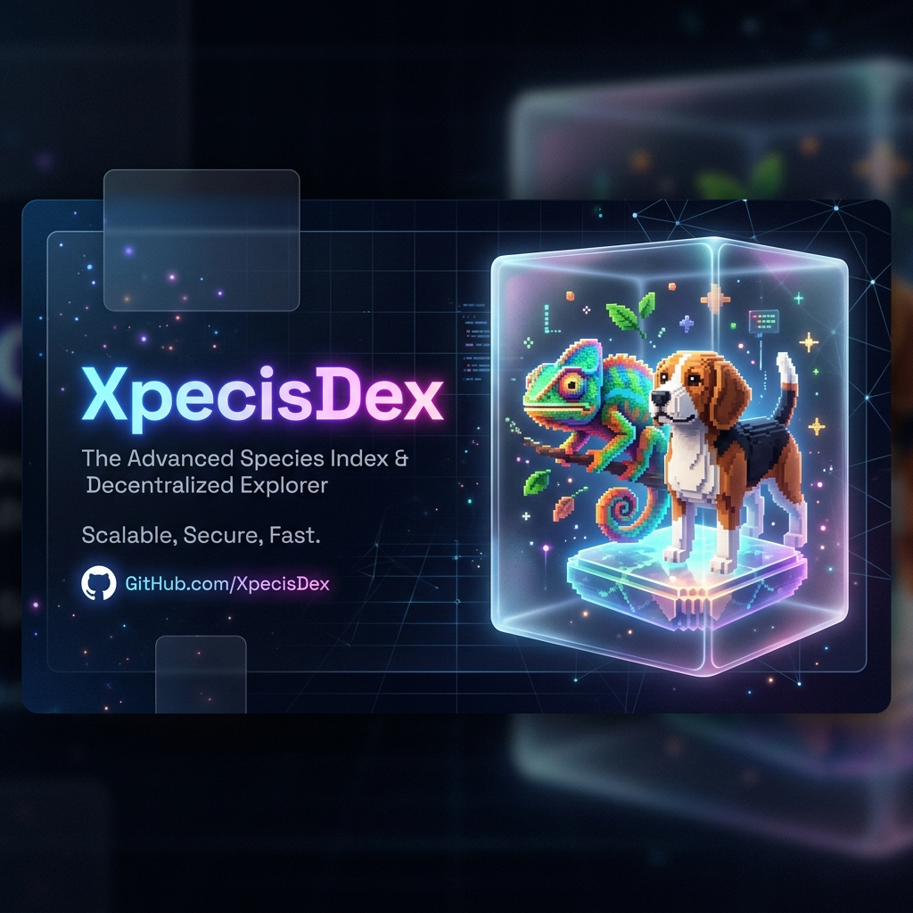
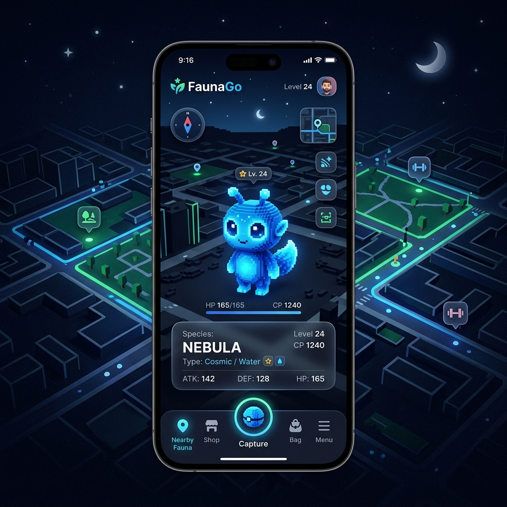

<div align="center">
  

  <h1>🌌 XpecisDex</h1>
  <p><b>El Ecosistema Definitivo de Generación y Colección de Especies en 3D Voxel</b></p>

  <!-- Badges -->
  <p>
    
    
    
    
  </p>

  <h3>Estado del Proyecto: En Desarrollo Activo</h3>
  <!-- Progress Bar -->
  
</div>

<br>

---

## 📖 Descripción del Proyecto

**XpecisDex** es una revolucionaria plataforma multipropósito que combina la emoción de un juego estilo *Pokémon Go* con el poder de la generación procedural e Inteligencia Artificial para modelos en **3D Voxel**. 

El proyecto se compone de múltiples sistemas interconectados, desde la generación de activos (assets) hasta la interacción y colección de los mismos en Realidad Aumentada (AR).

<br>

## 🧩 Arquitectura y Módulos

El repositorio actúa como un **monorepo** que consolida las diferentes áreas del ecosistema:

| Módulo / Carpeta | Descripción | Tecnología Principal | Estado |
| :--- | :--- | :---: | :---: |
| 📱 **`faunago/`** | Aplicación móvil tipo *Pokémon Go* para explorar, capturar y visualizar especies voxelizadas en 3D. | React Native / Expo | 🟢 Activo |
| 🤖 **`goxel-mcp/`** | Servidor **MCP** (Model Context Protocol) para la generación inteligente y automatizada de archivos `.vox`. | Node.js | 🟢 Activo |
| 🎲 **`3d-voxel-gen/`** | Scripts y herramientas especializadas en la conversión de texto a modelos Voxel (`text2vox`). | Python | 🟡 Desarrollo |
| 🦎 **Scripts Voxel** | Scripts (ej. `chameleon5_voxel.py`) y manifiestos para la creación procedural de especies hiper-detalladas. | Python / JSON | 🟢 Activo |
| 🎮 **`AlterLab_GameForge/`** | Herramientas experimentales de motor y renderizado de mecánicas de juego. | C++ / JS | 🟣 Experimental |

<br>

## 🖼️ Interfaz (FaunaGo)

<div align="center">
  
  <br><br>
  <p><i>FaunaGo: Explora tu mundo y descubre especies exóticas en 3D Voxel.</i></p>
</div>

<br>

## 🚀 Guía de Inicio Rápido

### 1. Requisitos Previos
- **Node.js** (v18+)
- **Python** (3.10+)
- **Expo CLI** (`npm install -g expo-cli`)
- Entorno de desarrollo para React Native (Android Studio / Xcode)

### 2. Instalación y Ejecución de FaunaGo
```bash
# Clonar el repositorio
git clone https://github.com/luigilaxmaster-coder/XpecisDex.git
cd XpecisDex/faunago

# Instalar dependencias e iniciar
npm install
npm run dev
```

### 3. Servidor Goxel-MCP
```bash
cd ../goxel-mcp
npm install
# Conecta el servidor MCP a tu entorno local o IA para generar Voxel art automáticamente.
```

<br>

## 🎨 Paleta de Colores y Estética

El proyecto utiliza una estética moderna enfocada en el **Glassmorphism** y **Cyberpunk Neón** para la interfaz, contrastando con la belleza retro-pixelada de los modelos Voxel.

| Elemento | Hex | Color Visual |
| --- | --- | --- |
| **Fondo Principal** | `#0D1117` |  Dark |
| **Neón Primario** | `#00F0FF` |  Cyan |
| **Acento** | `#FF0055` |  Pink |
| **Paneles (Glass)** | `rgba(255,255,255,0.05)` | Translúcido |

<br>

## 🗺️ Hoja de Ruta (Roadmap)

- [x] Estructura inicial del Monorepo.
- [x] Generación procedural de Voxels (`chameleon`, `beagle`, `alien`).
- [x] Servidor MCP integrado (`goxel-mcp`).
- [ ] Renderizado en AR dentro de la app móvil.
- [ ] Pokedex de Especies (XpecisDex) interactiva.
- [ ] Soporte multijugador para intercambios.

<br>

---
<div align="center">
  <p>Construido con ❤️ por <b>LuigiLaxMaster</b></p>
</div>
